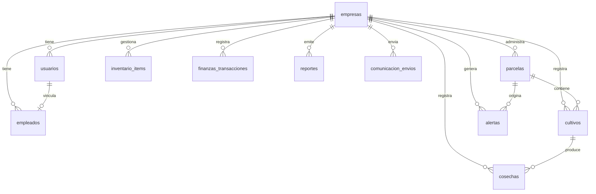

# Diccionario de Datos AgroSync

Version: 1.0  
Fecha de actualizacion: 2026-06-27  
Base de datos: `agrosync`  
Motor objetivo: MySQL 8 / MariaDB compatible  
Codificacion: `utf8mb4_unicode_ci`

## 1. Proposito

Este documento describe la estructura logica y fisica de datos del sistema AgroSync. Su objetivo es servir como referencia para desarrollo, soporte, auditoria, integracion con reportes y mantenimiento de base de datos.

AgroSync administra empresas agricolas, usuarios, empleados, parcelas georreferenciadas, cultivos, cosechas, inventario, finanzas, alertas, reportes y registros de comunicacion.

## 2. Convenciones Generales

| Convencion | Descripcion |
|---|---|
| Identificadores | Se usan codigos legibles en `VARCHAR(36)` para las entidades principales. |
| Fechas | `DATE` para eventos de calendario y `DATETIME` para eventos con hora. |
| Moneda | Los campos monetarios se almacenan en lempiras hondurenas con sufijo `_hnl`. |
| Geodatos | Las parcelas usan `POINT` y `POLYGON` con SRID 4326. |
| Seguridad | Las contrasenas se almacenan como hash en `password_hash`; nunca en texto plano. |
| Multiempresa | La mayoria de tablas dependen de `empresa_id` para aislar datos por empresa. |
| Estados | Los estados operativos se restringen con `ENUM` cuando el catalogo es cerrado. |

## 3. Diagrama Entidad Relacion

## 4. Catalogos y Valores Permitidos

### Planes de empresa

| Valor | Uso |
|---|---|
| `Starter` | Plan inicial o basico. |
| `Pro` | Plan operativo intermedio. |
| `Enterprise` | Plan corporativo o avanzado. |

### Estados de empresa

| Valor | Uso |
|---|---|
| `Activa` | Empresa habilitada para operar. |
| `Inactiva` | Empresa pausada sin operacion activa. |
| `Suspendida` | Empresa bloqueada por condicion administrativa. |

### Roles de usuario

| Valor | Alcance esperado |
|---|---|
| `Administrador` | Gestion general del sistema y datos administrativos. |
| `Administrador IT` | Acceso tecnico general a modulos y configuracion. |
| `Gerente de Campo` | Gestion operativa agricola. |
| `Supervisor` | Seguimiento de operaciones y personal. |
| `Operador` | Registro de actividades operativas. |
| `Analista` | Consulta, analisis y reportes. |
| `Jornalero` | Acceso limitado a tareas de campo. |

### Departamentos de acceso

| Valor | Modulos esperados |
|---|---|
| `AdministradorIT` | Acceso general y configuracion. |
| `Administrativo` | Empresas, usuarios, finanzas, reportes. |
| `Operativo` | Parcelas, cultivos, cosechas, empleados, alertas. |
| `Tecnologico` | Monitoreo, analitica, soporte y configuracion tecnica. |

### Estados operativos

| Entidad | Valores |
|---|---|
| Usuarios | `Activo`, `Inactivo`, `Suspendido` |
| Empleados | `Activo`, `Inactivo` |
| Parcelas | `Activa`, `Alerta`, `En Preparacion`, `En Descanso` |
| Cultivos | `Nuevo`, `En Progreso`, `Alerta`, `Cosechado` |
| Cosechas | Calidad: `Premium`, `Estandar`, `Baja` |
| Alertas | Severidad: `Baja`, `Media`, `Alta` |
| Reportes | Estado: `Listo`, `Generando`, `Enviado` |
| Comunicacion | Canal: `Correo`, `WhatsApp`, `Descarga` |

## 5. Estandar de Codigos

Los codigos se disenan para ser cortos, legibles y relacionados con la entidad y el tipo de siembra cuando aplica.

| Entidad | Formato | Ejemplo | Descripcion |
|---|---|---|---|
| Empresas | `EMP-###` | `EMP-001` | Consecutivo de empresa. |
| Parcelas | `PAR-TIP-###` | `PAR-MAI-001` | Parcela relacionada con cultivo principal. |
| Cultivos | `CUL-TIP-###` | `CUL-CAF-001` | Cultivo por tipo de siembra. |
| Cosechas | `COS-TIP-###` | `COS-FRI-001` | Cosecha asociada al cultivo. |

Codigos de tipo de siembra:

| Codigo | Cultivo |
|---|---|
| `MAI` | Maiz |
| `CAF` | Cafe |
| `FRI` | Frijol |
| `SOR` | Sorgo |
| `PAL` | Palma |
| `ARR` | Arroz |
| `GEN` | Generico cuando no se identifica el cultivo |

## 6. Tablas

### 6.1 `empresas`

Registra las empresas agricolas que usan la plataforma.

| Campo | Tipo | Nulo | Llave | Default | Descripcion |
|---|---|---:|---|---|---|
| `id` | `VARCHAR(36)` | No | PK | - | Codigo unico de empresa. |
| `nombre` | `VARCHAR(255)` | No | - | - | Nombre legal o comercial. |
| `nit` | `VARCHAR(64)` | No | UNIQUE | - | Identificacion tributaria. |
| `email` | `VARCHAR(255)` | No | - | - | Correo de contacto. |
| `telefono` | `VARCHAR(64)` | No | - | - | Telefono principal. |
| `direccion` | `VARCHAR(255)` | No | - | - | Direccion fisica. |
| `ciudad` | `VARCHAR(120)` | No | - | - | Ciudad o departamento. |
| `pais` | `VARCHAR(120)` | No | - | `Honduras` | Pais de operacion. |
| `plan` | `ENUM` | No | - | `Starter` | Plan contratado. |
| `estado` | `ENUM` | No | - | `Activa` | Estado administrativo. |
| `fecha_registro` | `DATETIME` | No | - | `CURRENT_TIMESTAMP` | Fecha de creacion. |
| `notas` | `TEXT` | Si | - | `NULL` | Observaciones internas. |

Reglas:

- `nit` no puede repetirse.
- No se debe eliminar una empresa con usuarios, parcelas u operaciones asociadas.

### 6.2 `usuarios`

Registra usuarios que pueden iniciar sesion y operar modulos segun rol/departamento.

| Campo | Tipo | Nulo | Llave | Default | Descripcion |
|---|---|---:|---|---|---|
| `id` | `VARCHAR(36)` | No | PK | - | Codigo unico de usuario. |
| `empresa_id` | `VARCHAR(36)` | No | FK | - | Empresa a la que pertenece. |
| `nombre` | `VARCHAR(120)` | No | - | - | Nombre del usuario. |
| `apellido` | `VARCHAR(120)` | No | - | - | Apellido del usuario. |
| `email` | `VARCHAR(255)` | No | UNIQUE | - | Correo usado para login. |
| `telefono` | `VARCHAR(64)` | No | - | - | Telefono del usuario. |
| `rol` | `ENUM` | No | - | - | Cargo funcional. |
| `departamento` | `ENUM` | No | - | `Administrativo` | Segmento de acceso. |
| `estado` | `ENUM` | No | - | `Activo` | Estado de acceso. |
| `password_hash` | `VARCHAR(255)` | No | - | - | Hash de contrasena. |
| `intentos_fallidos` | `INT` | No | - | `0` | Conteo de login fallido. |
| `bloqueado_en` | `DATETIME` | Si | - | `NULL` | Momento de bloqueo. |
| `fecha_creacion` | `DATETIME` | No | - | `CURRENT_TIMESTAMP` | Fecha de alta. |
| `ultimo_acceso` | `DATETIME` | Si | - | `NULL` | Ultimo inicio de sesion. |
| `notas` | `TEXT` | Si | - | `NULL` | Observaciones internas. |

Reglas:

- `email` no puede duplicarse.
- La contrasena se valida en la aplicacion y se guarda en `password_hash`.
- El acceso a modulos debe derivarse de `rol` y `departamento`.
- `empresa_id` usa `ON DELETE RESTRICT` para proteger historial.

### 6.3 `empleados`

Registra personal operativo o administrativo de una empresa. Puede vincularse opcionalmente a un usuario.

| Campo | Tipo | Nulo | Llave | Default | Descripcion |
|---|---|---:|---|---|---|
| `id` | `VARCHAR(36)` | No | PK | - | Codigo unico de empleado. |
| `empresa_id` | `VARCHAR(36)` | No | FK | - | Empresa empleadora. |
| `usuario_id` | `VARCHAR(36)` | Si | FK | `NULL` | Usuario asociado, si tiene acceso. |
| `nombre` | `VARCHAR(180)` | No | - | - | Nombre completo. |
| `cargo` | `VARCHAR(120)` | No | - | - | Puesto laboral. |
| `salario_mensual_hnl` | `DECIMAL(12,2)` | No | - | `0` | Salario mensual. |
| `estado` | `ENUM` | No | - | `Activo` | Estado laboral. |

Reglas:

- Si se elimina un usuario, `usuario_id` queda en `NULL`.
- El empleado permanece como registro laboral independiente del acceso al sistema.

### 6.4 `parcelas`

Representa terrenos agricolas con informacion geografica.

| Campo | Tipo | Nulo | Llave | Default | Descripcion |
|---|---|---:|---|---|---|
| `id` | `VARCHAR(36)` | No | PK | - | Codigo de parcela. |
| `empresa_id` | `VARCHAR(36)` | No | FK | - | Empresa propietaria. |
| `nombre` | `VARCHAR(120)` | No | - | - | Nombre de la parcela. |
| `zona` | `VARCHAR(120)` | No | - | - | Zona geografica o administrativa. |
| `hectareas` | `DECIMAL(10,2)` | No | - | - | Extension del terreno. |
| `estado` | `ENUM` | No | - | `Activa` | Estado productivo. |
| `centro` | `POINT SRID 4326` | No | SPATIAL | - | Punto central de ubicacion. |
| `poligono` | `POLYGON SRID 4326` | No | SPATIAL | - | Limites de parcela. |

Reglas:

- `hectareas` debe ser mayor que cero.
- `centro` y `poligono` deben conservar SRID 4326.
- Una parcela no debe eliminarse si tiene cultivos asociados.

### 6.5 `cultivos`

Registra siembras en parcelas.

| Campo | Tipo | Nulo | Llave | Default | Descripcion |
|---|---|---:|---|---|---|
| `id` | `VARCHAR(36)` | No | PK | - | Codigo de cultivo. |
| `empresa_id` | `VARCHAR(36)` | No | FK | - | Empresa responsable. |
| `parcela_id` | `VARCHAR(36)` | No | FK | - | Parcela sembrada. |
| `nombre` | `VARCHAR(180)` | No | - | - | Nombre o tipo de cultivo. |
| `fecha_siembra` | `DATE` | No | - | - | Fecha de siembra. |
| `fecha_cosecha_estimada` | `DATE` | Si | - | `NULL` | Fecha estimada de cosecha. |
| `etapa` | `VARCHAR(80)` | No | - | - | Etapa fenologica u operativa. |
| `estado` | `ENUM` | No | - | `Nuevo` | Estado del cultivo. |

Reglas:

- `parcela_id` debe existir y pertenecer a la misma empresa.
- `fecha_cosecha_estimada` no debe ser anterior a `fecha_siembra`.
- Los cultivos en `Cosechado` pueden tener registros en `cosechas`.

### 6.6 `cosechas`

Registra produccion obtenida de cultivos.

| Campo | Tipo | Nulo | Llave | Default | Descripcion |
|---|---|---:|---|---|---|
| `id` | `VARCHAR(36)` | No | PK | - | Codigo de cosecha. |
| `empresa_id` | `VARCHAR(36)` | No | FK | - | Empresa responsable. |
| `cultivo_id` | `VARCHAR(36)` | No | FK | - | Cultivo cosechado. |
| `fecha` | `DATE` | No | - | - | Fecha de cosecha. |
| `toneladas` | `DECIMAL(12,2)` | No | - | - | Volumen cosechado. |
| `calidad` | `ENUM` | No | - | `Estandar` | Calidad de produccion. |

Reglas:

- `toneladas` debe ser mayor que cero.
- `cultivo_id` debe existir y pertenecer a la misma empresa.

### 6.7 `inventario_items`

Controla insumos, herramientas o productos del inventario.

| Campo | Tipo | Nulo | Llave | Default | Descripcion |
|---|---|---:|---|---|---|
| `id` | `VARCHAR(36)` | No | PK | - | Codigo de item. |
| `empresa_id` | `VARCHAR(36)` | No | FK | - | Empresa propietaria. |
| `nombre` | `VARCHAR(180)` | No | - | - | Nombre del item. |
| `categoria` | `VARCHAR(80)` | No | - | - | Categoria de inventario. |
| `stock` | `DECIMAL(12,2)` | No | - | `0` | Existencia actual. |
| `unidad` | `VARCHAR(24)` | No | - | - | Unidad de medida. |
| `stock_minimo` | `DECIMAL(12,2)` | No | - | `0` | Nivel minimo aceptable. |
| `costo_unitario_hnl` | `DECIMAL(12,2)` | No | - | `0` | Costo unitario. |
| `ubicacion` | `VARCHAR(120)` | No | - | - | Bodega o ubicacion. |

Reglas:

- `stock`, `stock_minimo` y `costo_unitario_hnl` no deben ser negativos.
- Si `stock <= stock_minimo`, el modulo puede generar alerta operativa.

### 6.8 `finanzas_transacciones`

Registra ingresos y egresos de la operacion agricola.

| Campo | Tipo | Nulo | Llave | Default | Descripcion |
|---|---|---:|---|---|---|
| `id` | `VARCHAR(36)` | No | PK | - | Codigo de transaccion. |
| `empresa_id` | `VARCHAR(36)` | No | FK | - | Empresa asociada. |
| `concepto` | `VARCHAR(255)` | No | - | - | Descripcion del movimiento. |
| `categoria` | `VARCHAR(80)` | No | - | - | Categoria financiera. |
| `tipo` | `ENUM` | No | - | - | `Ingreso` o `Egreso`. |
| `monto_hnl` | `DECIMAL(14,2)` | No | - | - | Monto en lempiras. |
| `fecha` | `DATE` | No | - | - | Fecha del movimiento. |

Reglas:

- `monto_hnl` debe ser mayor que cero.
- El signo contable lo determina `tipo`, no el valor negativo.

### 6.9 `alertas`

Registra riesgos o eventos que requieren atencion.

| Campo | Tipo | Nulo | Llave | Default | Descripcion |
|---|---|---:|---|---|---|
| `id` | `VARCHAR(36)` | No | PK | - | Codigo de alerta. |
| `empresa_id` | `VARCHAR(36)` | No | FK | - | Empresa afectada. |
| `parcela_id` | `VARCHAR(36)` | Si | FK | `NULL` | Parcela relacionada. |
| `tipo` | `VARCHAR(80)` | No | - | - | Tipo de alerta. |
| `severidad` | `ENUM` | No | - | - | Nivel de riesgo. |
| `mensaje` | `VARCHAR(255)` | No | - | - | Descripcion breve. |
| `resuelta` | `BOOLEAN` | No | - | `FALSE` | Indica si fue atendida. |
| `creada_en` | `DATETIME` | No | - | `CURRENT_TIMESTAMP` | Fecha de generacion. |

Reglas:

- Si se elimina una parcela, la alerta conserva historial con `parcela_id = NULL`.
- Alertas de severidad `Alta` deben destacarse en dashboard.

### 6.10 `reportes`

Registra reportes generados o programados.

| Campo | Tipo | Nulo | Llave | Default | Descripcion |
|---|---|---:|---|---|---|
| `id` | `VARCHAR(36)` | No | PK | - | Codigo de reporte. |
| `empresa_id` | `VARCHAR(36)` | No | FK | - | Empresa propietaria. |
| `titulo` | `VARCHAR(180)` | No | - | - | Titulo del reporte. |
| `tipo` | `VARCHAR(80)` | No | - | - | Tipo funcional. |
| `fecha` | `DATE` | No | - | - | Fecha del reporte. |
| `formato` | `ENUM` | No | - | `PDF` | Formato de salida. |
| `destinatario` | `VARCHAR(255)` | Si | - | `NULL` | Correo o contacto destino. |
| `estado` | `ENUM` | No | - | `Listo` | Estado de generacion/envio. |
| `descripcion` | `TEXT` | Si | - | `NULL` | Resumen del contenido. |
| `creado_en` | `DATETIME` | No | - | `CURRENT_TIMESTAMP` | Fecha de creacion. |

Reglas:

- `formato` define la salida esperada: PDF o Excel.
- `estado = Enviado` debe tener trazabilidad en comunicacion si aplica.

### 6.11 `comunicacion_envios`

Audita envios y descargas de recursos generados desde el sistema.

| Campo | Tipo | Nulo | Llave | Default | Descripcion |
|---|---|---:|---|---|---|
| `id` | `VARCHAR(36)` | No | PK | - | Codigo de envio. |
| `empresa_id` | `VARCHAR(36)` | No | FK | - | Empresa asociada. |
| `recurso` | `VARCHAR(40)` | No | - | - | Tipo de recurso enviado. |
| `recurso_id` | `VARCHAR(36)` | No | - | - | ID del recurso relacionado. |
| `canal` | `ENUM` | No | - | - | Canal usado. |
| `destino` | `VARCHAR(255)` | Si | - | `NULL` | Destinatario. |
| `asunto` | `VARCHAR(180)` | Si | - | `NULL` | Asunto del envio. |
| `mensaje` | `TEXT` | Si | - | `NULL` | Mensaje enviado. |
| `creado_en` | `DATETIME` | No | - | `CURRENT_TIMESTAMP` | Fecha del registro. |

Reglas:

- `recurso` y `recurso_id` permiten asociar envios a reportes u otros recursos.
- Para canal `Descarga`, `destino` puede quedar en `NULL`.

## 7. Relaciones Fisicas

| Constraint | Tabla origen | Campo origen | Tabla destino | Campo destino | Update | Delete |
|---|---|---|---|---|---|---|
| `fk_usuarios_empresa` | `usuarios` | `empresa_id` | `empresas` | `id` | CASCADE | RESTRICT |
| `fk_empleados_empresa` | `empleados` | `empresa_id` | `empresas` | `id` | CASCADE | RESTRICT |
| `fk_empleados_usuario` | `empleados` | `usuario_id` | `usuarios` | `id` | CASCADE | SET NULL |
| `fk_parcelas_empresa` | `parcelas` | `empresa_id` | `empresas` | `id` | CASCADE | RESTRICT |
| `fk_cultivos_empresa` | `cultivos` | `empresa_id` | `empresas` | `id` | CASCADE | RESTRICT |
| `fk_cultivos_parcela` | `cultivos` | `parcela_id` | `parcelas` | `id` | CASCADE | RESTRICT |
| `fk_cosechas_empresa` | `cosechas` | `empresa_id` | `empresas` | `id` | CASCADE | RESTRICT |
| `fk_cosechas_cultivo` | `cosechas` | `cultivo_id` | `cultivos` | `id` | CASCADE | RESTRICT |
| `fk_inventario_empresa` | `inventario_items` | `empresa_id` | `empresas` | `id` | CASCADE | RESTRICT |
| `fk_finanzas_empresa` | `finanzas_transacciones` | `empresa_id` | `empresas` | `id` | CASCADE | RESTRICT |
| `fk_alertas_empresa` | `alertas` | `empresa_id` | `empresas` | `id` | CASCADE | RESTRICT |
| `fk_alertas_parcela` | `alertas` | `parcela_id` | `parcelas` | `id` | CASCADE | SET NULL |
| `fk_reportes_empresa` | `reportes` | `empresa_id` | `empresas` | `id` | CASCADE | RESTRICT |
| `fk_comunicacion_empresa` | `comunicacion_envios` | `empresa_id` | `empresas` | `id` | CASCADE | RESTRICT |

## 8. Indices

| Tabla | Indice | Tipo | Campos | Uso |
|---|---|---|---|---|
| `empresas` | PRIMARY | BTree | `id` | Busqueda por empresa. |
| `empresas` | UNIQUE | BTree | `nit` | Evitar empresas duplicadas. |
| `usuarios` | PRIMARY | BTree | `id` | Busqueda por usuario. |
| `usuarios` | UNIQUE | BTree | `email` | Login y control de duplicidad. |
| `parcelas` | `idx_parcelas_centro` | SPATIAL | `centro` | Consultas por punto geografico. |
| `parcelas` | `idx_parcelas_poligono` | SPATIAL | `poligono` | Consultas por area geografica. |

## 9. Consideraciones de Seguridad

- `password_hash` es obligatorio y no debe exponerse por API.
- La clave general de administrador debe vivir en variable de entorno `ADMIN_GENERAL_PASSWORD`.
- `SESSION_SECRET` debe cambiarse por ambiente y nunca publicarse en repositorios.
- Los endpoints administrativos deben validar sesion activa y rol/departamento.
- Los correos de usuario son unicos para evitar duplicidad en login.

## 10. Consideraciones de Calidad de Datos

| Regla | Aplicacion |
|---|---|
| Correos validos | Empresas, usuarios y destinatarios de comunicacion. |
| Telefonos normalizados | Formato recomendado Honduras: `+504 ####-####`. |
| Montos positivos | Finanzas, salarios, costos e inventario. |
| Fechas coherentes | Siembra antes de cosecha estimada y cosecha real. |
| Geometrias validas | `centro` y `poligono` con SRID 4326. |
| Empresa consistente | Registros hijos deben pertenecer a la misma empresa. |

## 11. Archivos Relacionados

| Archivo | Descripcion |
|---|---|
| `db/mysql-schema.sql` | Esquema principal MySQL. |
| `db/02-short-relational-codes.sql` | Migracion a codigos cortos por entidad/cultivo. |
| `db/03-recode-generic-crop-codes.sql` | Ajuste de codigos genericos segun nombre de cultivo. |
| `db/postgis-parcelas.sql` | Alternativa PostGIS para geoprocesamiento avanzado. |
| `src/types/models.ts` | Interfaces TypeScript usadas por la aplicacion. |

## 12. Notas de Mantenimiento

- Antes de cambiar un `ENUM`, revisar formularios, validaciones de API y reportes.
- Antes de cambiar una relacion, revisar reglas `ON DELETE` para no perder historial.
- Si se agregan nuevas entidades operativas, deben incluir `empresa_id` para mantener aislamiento multiempresa.
- Si se agregan nuevos tipos de cultivo, actualizar las migraciones de codigos cortos para generar prefijos claros.
